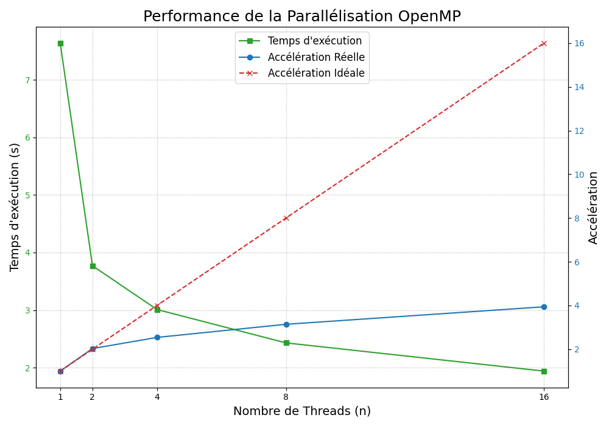
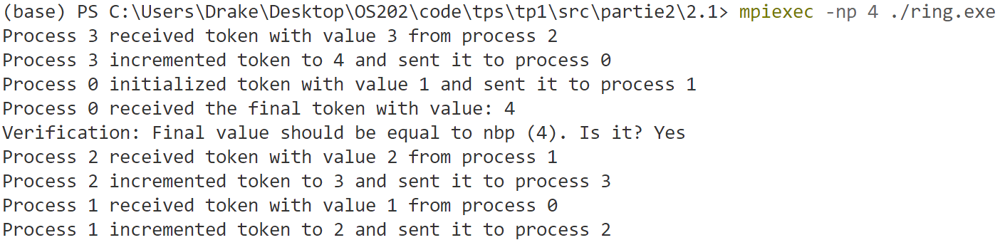

# TD1
#### Tianze Xia

## I. Produit matrice-matrice

```bash
cd ./tps/tp1/src/partie1

# Compilation
g++ Matrix.cpp ProdMatMat.cpp TestProductMatrix.cpp -o q1.exe

# Exécution
./q1.exe 1024
```
 

### 1.1 Effet de la taille de la matrice

|   n    | Temps (s) |  MFlops |
|:------:|:---------:| :------:|
|  1023  |   11.52   | 185.836 |
|  1024  |   13.69   | 156.859 |
|  1025  |   11.34   | 189.855 |


**Expliquation:**
Les résultats montrent une variation significative des performances en fonction de la taille de la matrice.  
Pour n=1024, la performance est plus faible par rapport aux tailles non alignées n=1023 et n=1025. Cette différence est due à l’alignement mémoire : 1024 est une puissance de 2, ce qui peut entraîner des conflits de cache (cache associatif), tandis que 1023 et 1025 répartissent mieux les accès mémoire, réduisant les cache misses et améliorant ainsi la performance.

### 1.2 Permutation des boucles

```bash
# Compilation
g++ Matrix.cpp ProdMatMat1.cpp TestProductMatrix.cpp -o q2_1.exe
g++ Matrix.cpp ProdMatMat2.cpp TestProductMatrix.cpp -o q2_2.exe
...

# Exécution
./q2_1.exe
...
```


  n   |  Ordre           | Temps (s) | MFlops |
:----:|:----------------:|:---------:|:-------:|
1     |i,j,k             |  11.37    | 188.912 |
2     |i,k,j             |  21.62    | 99.3481 |
3     |j,i,k             |  13.08    | 164.237 |
4     |j,k,i             |  9.96     | 215.521 |
5     |k,i,j             |  15.34    | 139.981 |
6     |k,j,i             |  9.87     | 217.581 |


**Discussion**

Les résultats montrent une forte dépendance de la performance à l'ordre des boucles. L'ordre k,j,i est le plus rapide (9.87s, 217.581 MFlops), suivi de j,k,i (9.96s, 215.521 MFlops), indiquant une meilleure exploitation du cache et de la localité mémoire. Ces résultats suggèrent que prioriser l'itération sur les colonnes (j) ou les lignes (k) avant les multiplications internes améliore les performances.


### 1.3 OpenMP

```bash
# Compilation
g++ -O3 -fopenmp TestProductMatrix.cpp ProdMatMat.cpp Matrix.cpp -o q3

# Exécution
$env:OMP_NUM_THREADS=1; ./q3
$env:OMP_NUM_THREADS=2; ./q3
...
```

  OMP_NUM         | MFlops  |     Temps (s)   |  Accélération  | 
:----------------:|:-------:|:---------------:|:--------------:|
1                 | 281.059 |     7.64     |     1.00    |
2                 | 569.471 |     3.77     |     2.03    |
4                 | 713.827 |     3.01     |     2.54    |
8                 | 882.153 |     2.43     |     3.14    |
16                | 1104.19 |     1.94     |     3.94    |




Comme le montre la courbe verte (Temps d'exécution) sur la figure, lorsque le nombre de threads augmente de 1 à 16, le temps d'exécution du programme diminue progressivement de 7,64 secondes à 1,94 seconde, ce qui prouve l'efficacité de la parallélisation.

Cependant, la courbe bleue (Accélération Réelle) indique que l'accélération réelle n'a pas atteint la croissance linéaire idéale représentée par la ligne pointillée rouge (Accélération Idéale). Avec 2 threads, nous avons obtenu une accélération proche de l'idéal de 2,03x ; mais avec 8 threads, l'accélération n'était que de 3,14, bien en deçà de l'idéal de 8x ; et lorsque le nombre de threads a atteint 16, l'accélération n'a augmenté que jusqu'à 3,94, indiquant que l'amélioration des performances a atteint un plateau.

### 1.4 Argumentation
Le phénomène de 1.3 révèle clairement le goulot d'étranglement du calcul parallèle : malgré l'augmentation du nombre de cœurs de calcul, les performances du programme sont strictement limitées par la bande passante mémoire. Tous les threads se disputent âprement l'accès à la mémoire principale, ce qui engendre un temps d'attente important et empêche ainsi l'ajout de nouveaux threads d'apporter une amélioration des performances. Ceci démontre que pour les tâches gourmandes en mémoire, l'augmentation de la puissance de calcul ne suffit pas ; elle doit être combinée à des stratégies d'accès à la mémoire plus efficaces (telles que l'optimisation du cache) pour obtenir une meilleure scalabilité.


### 1.5 Produit par blocs

```bash
# Compilation
g++ -O3 TestProductMatrix.cpp Matrix.cpp ProdMatMatByBloc.cpp -o q5

# Exécution
$env:OMP_NUM_THREADS=1
./q5
```

  szBlock         | Temps (s)  | MFlops |
:----------------:|:---------:|:-------:|
origine           | 8.21 | 261.697 |
1                 | 12.01 | 178.754 |
32                | 3.61 | 594.931 |
64                | 3.54 | 606.643 | 
128               | 3.78 | 568.151 |
256               | 7.49 | 286.901 |
512               | 9.34 | 229.981 |
1024              | 9.32 | 230.336 |

En testant différentes tailles de blocs dans un environnement monothread, nous avons constaté que les performances suivent une tendance parabolique typique :

- **Solution optimale :** szBlock = 64 offre les meilleures performances (3,54 secondes).

- **Taille trop petite (szBlock = 1) :** En raison de la surcharge supplémentaire liée à la boucle à six couches, les performances sont en réalité inférieures à celles de la version originale (12,01 secondes).

- **Taille trop grande (szBlock > 128) :** Lorsque la taille des blocs dépasse 128, les sous-blocs sont trop volumineux pour tenir entièrement dans le cache (L1/L2), ce qui provoque une saturation du cache et une chute brutale des performances. À partir de 1024, les performances redeviennent comparables à celles de la version originale (environ 9,3 secondes).


### 1.6 Interprétation
En comparant la version optimale par blocs (3,54 secondes) à la version « scalaire » originale (8,21 secondes), nous avons obtenu un gain de performance d'environ 2,3 fois (8,21 / 3,54).

Ce résultat démontre les avantages d'une optimisation pure du cache. À puissance de calcul monocœur constante, l'algorithme par blocs améliore significativement la localité temporelle des données, garantissant ainsi leur réutilisation après leur chargement dans le cache et réduisant le temps d'attente du processeur pour les données en mémoire principale. Ceci prouve qu'en calcul haute performance, l'efficacité d'accès à la mémoire est tout aussi importante que l'efficacité de calcul.

### 1.7 Bloc + OMP
```bash
# Compilation
g++ -O3 -fopenmp TestProductMatrix.cpp Matrix.cpp ProdMatMatByBloc.cpp -o q7

# Exécution
$env:OMP_NUM_THREADS=1; ./q7
$env:OMP_NUM_THREADS=2; ./q7
...
```

  szBlock      | OMP_NUM | Temps (s)  | MFlops | Accélération | 
:-------------:|:-------:|:-------:|:----------:|:----------:|
origine        | origine | 9.88 |    217.367     |   1.00    |
64             |  1      | 2.89 |    744.346     |   3.42    |
64             |  2      | 1.41 |    1520.24     |   7.01    |
64             |  4      | 0.74 |    2909.55     |   13.35   |
64             |  8      | 0.55 |    3877.89     |   17.96   |

Nous avons obtenu une accélération globale spectaculaire de 17,96x (de 9,88 s à 0,55 s).

Ceci est dû à l'effet synergique de l'**optimisation du cache combinée au parallélisme multicœur** :

* **Amélioration des performances :** Grâce au découpage en blocs (optimisation du cache), les performances monothread sont déjà 3,4 fois supérieures à celles de la version originale (9,88 s contre 2,89 s).

* **Libération de la limitation de la mémoire :** Contrairement à la version parallèle scalaire, le découpage en blocs réduit considérablement la fréquence d'accès à la mémoire principale pour chaque thread. Ceci atténue efficacement la contention de la bande passante mémoire lors du fonctionnement multicœur, permettant à OpenMP d'utiliser les 8 cœurs plus efficacement. Il en résulte des performances et une évolutivité bien supérieures à celles de la version scalaire.
  
### 1.8 Comparaison avec BLAS, Eigen et numpy
```bash
# Compilation
g++ -O3 test_product_matrice_blas.cpp ProdMatMat.cpp Matrix.cpp -o q8 -lopenblas

# Exécution
$env:OMP_NUM_THREADS=8; ./q8
```

| Méthode  | Temps (s)  | MFlops |
|:-------------:|:-------:|:-------:|
| Bloc + OMP    | 0.55 |  3877.89  |
|      BLAS      | 0.016 |  137070  |

Les performances du produit matrice-matrice avec BLAS sont plusieurs ordres de grandeur supérieures à celles de notre implémentation optimisée. Parce que BLAS a exploite des optimisations bas niveau.


# II. Partie 2 - Jeton
## 2.1 Circulation d’un jeton
```bash
# Compilation
$MPI_INC = "C:\Program Files (x86)\Microsoft SDKs\MPI\Include"
$MPI_LIB = "C:\Program Files (x86)\Microsoft SDKs\MPI\Lib\x64"
gcc ring.c -o ring -I"$MPI_INC" -L"$MPI_LIB" -lmsmpi

# Exécution
mpiexec -np 4 ./ring.exe
```



On constate que **l'ordre d'affichage des résultats n'est pas fixe.** Ceci est dû à l'indépendance des processus parallèles et au mécanisme de mise en mémoire tampon des entrées/sorties.

Dans un programme MPI, plusieurs processus sont des entités indépendantes s'exécutant simultanément. Bien qu'il existe un ordre logique dans le code, les opérations `printf` ne sont pas synchronisées entre les processus. Chaque processus possède sa propre mémoire tampon de sortie, et le système d'exploitation affiche aléatoirement le contenu de ces mémoires sur l'écran du terminal selon une planification. Par conséquent, l'ordre d'affichage des résultats ne correspond pas à l'ordre réel d'exécution du programme ; seule la validité du résultat final permet de juger de la réussite de l'exécution.

## 2.2 Calcul de $\pi$
### 2.2.1 C + OpenMP
```bash
# Compilation
gcc -O3 -fopenmp pi_omp.c -o pi_omp.exe

# Exécution
$env:OMP_NUM_THREADS=1; ./pi_omp.exe 1000000000
...
```

  OMP_NUM         |  Temps (s)   |  Accélération  | 
:----------------:|:---------------:|:--------------:|
1                 | 2.01 |    1.00    |
2                 | 1.01 |    1.99    |
4                 | 0.55 |    3.65    |
8                 | 0.41 |    4.90    |


### 2.2.2 C + MPI 
```bash
# Compilation
$MPI_INC = "C:\Program Files (x86)\Microsoft SDKs\MPI\Include"
$MPI_LIB = "C:\Program Files (x86)\Microsoft SDKs\MPI\Lib\x64"
gcc pi_mpi.c -o pi_mpi.exe -I"$MPI_INC" -L"$MPI_LIB" -lmsmpi

# Exécution
mpiexec -np 1 ./pi_mpi.exe 1000000000
...
```

  NUM_Processus         |  Temps (s)   |  Accélération  | 
:----------------:|:---------------:|:--------------:|
1                 | 17.21 |    1.00    |
2                 | 8.76 |    1.96    |
4                 | 4.46 |    3.86    |
8                 | 2.87 |    6.00    |

### 2.2.3 Python + MPI 
```bash
# Exécution
mpiexec -np 1 python pi_mpi.py
...
```

  NUM_Processus         |  Temps (s)   |  Accélération  | 
:----------------:|:---------------:|:--------------:|
1                 | 167.16 |    1.00    |
2                 | 88.39 |    1.89   |
4                 | 106.77 |    1.57    |
8                 | 115.21 |    1.45    |

Nous avons constaté qu'avec MPI, le temps de calcul de Python était nettement supérieur à celui de C, principalement pour deux raisons :

* **Efficacité d'exécution :** C présente un avantage considérable pour les tâches gourmandes en calcul, avec une efficacité monocœur environ dix fois supérieure à celle de Python.

* **Gestion de la mémoire :** les programmes C maintiennent une consommation de mémoire extrêmement faible grâce au traitement en flux (calcul point par point) ; tandis que les opérations vectorisées de Python (NumPy), lors du traitement de données volumineuses, nécessitent la pré-allocation de tableaux immenses, ce qui sature rapidement la mémoire physique et provoque des échanges de données sur disque par le système d'exploitation, réduisant ainsi l'efficacité parallèle au lieu de l'accroître.

## 2.3  Diffusion dans un hypercube
```bash
# Compilation
$MPI_INC = "C:\Program Files (x86)\Microsoft SDKs\MPI\Include"
$MPI_LIB = "C:\Program Files (x86)\Microsoft SDKs\MPI\Lib\x64"
gcc hypercube.c -o hypercube.exe -I"$MPI_INC" -L"$MPI_LIB" -lmsmpi

# Exécution
mpiexec -np 1 ./hypercube.exe
...
```